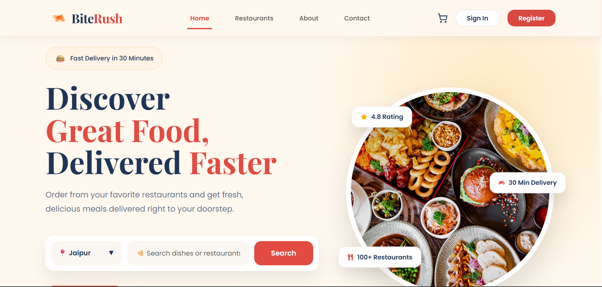
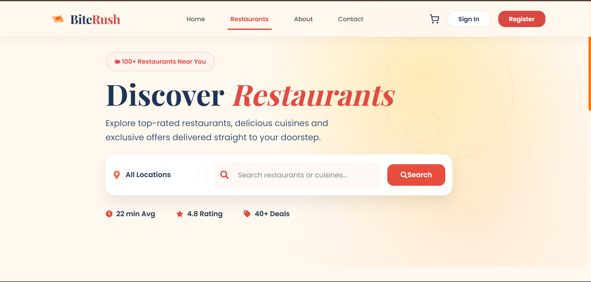
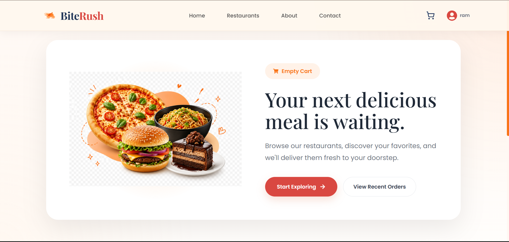
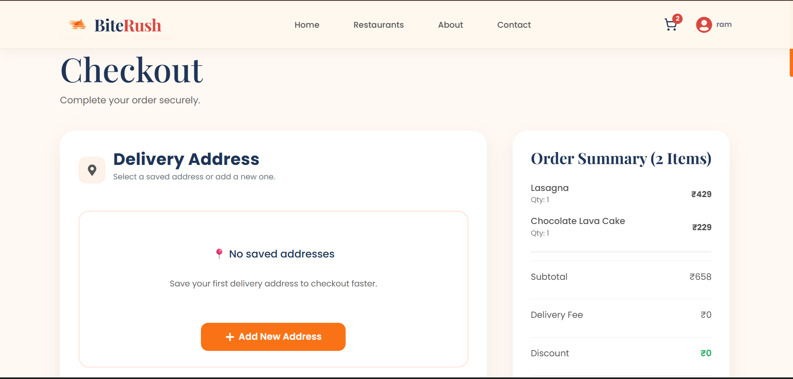
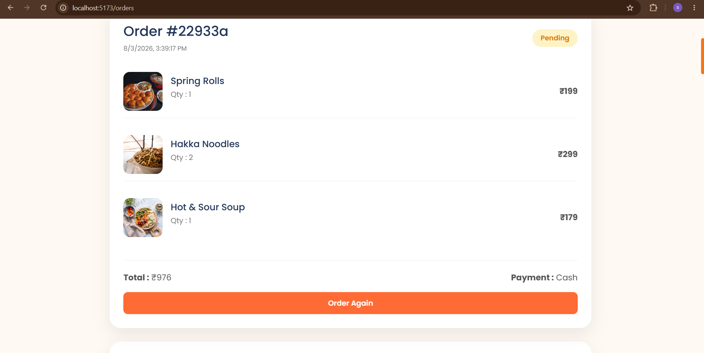
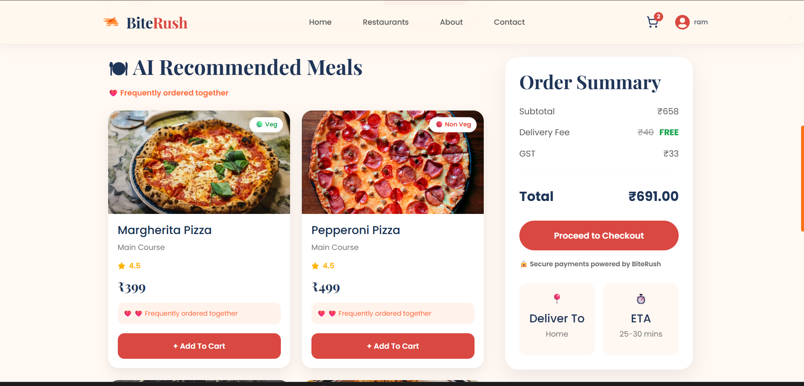
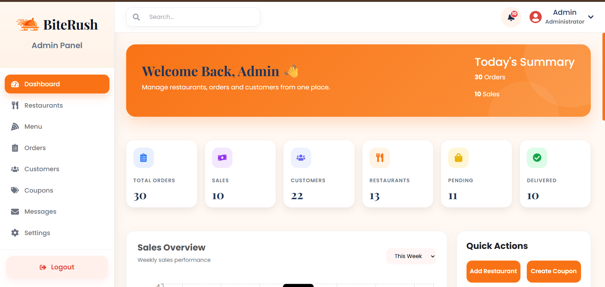
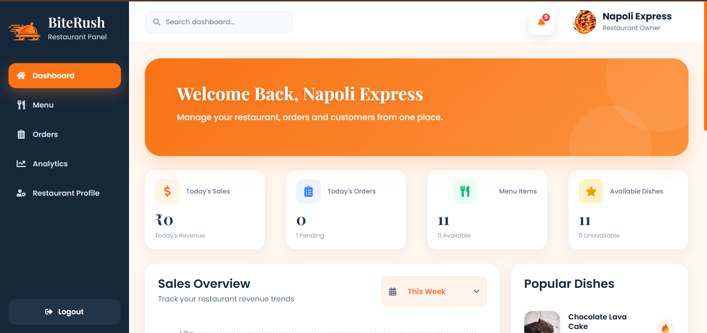

# 🍔 BiteRush

<div align="center">

### A Full Stack MERN Food Ordering Platform

**Fast • Responsive • Smart • User-Friendly**

BiteRush is a modern full-stack food ordering web application that connects customers with restaurants through an intuitive interface. It features secure authentication, restaurant and admin dashboards, AI-powered meal recommendations, and a Smart Reorder system to provide a seamless food ordering experience.

---

### 🚀 Built With

React • Bootstrap • Node.js • Express.js • MongoDB • JWT • Mongoose • Multer

</div>

---

# 📖 Overview

BiteRush is designed to simplify online food ordering while providing powerful management tools for restaurants and administrators.

The platform includes:

- 👤 Customer Portal
- 🍽 Restaurant Dashboard
- 🛠 Admin Dashboard
- 🤖 AI Meal Recommendation Engine
- 🔄 Smart Reorder System
- 🎟 Coupon Management
- 📱 Fully Responsive Design

---

# ✨ Features

## 👤 Customer Features

- Secure User Registration & Login
- JWT Authentication
- Browse Restaurants
- Search Restaurants
- Filter by Cuisine & Category
- Restaurant Details Page
- Add to Cart
- Wishlist
- Checkout
- Order History
- Contact Support
- Responsive Design

---

## 🍽 Restaurant Dashboard

Restaurant partners can

- Dashboard Analytics
- Manage Menu
- Add Menu Items
- Edit Menu Items
- Delete Menu Items
- View Orders
- Update Order Status
- Manage Restaurant Profile

---

## 🛠 Admin Dashboard

Administrators can

- Dashboard Overview
- Manage Restaurants
- Manage Customers
- Manage Orders
- Manage Coupons
- View Customer Messages
- Block / Unblock Customers
- Delete Records
- Manage Platform Data

---

# 🚀 Unique Features

## 🔄 Smart Reorder

One-click repeat ordering based on previous purchases.

### Highlights

- Reorder previous meals instantly
- Restaurant availability validation
- Menu item availability validation
- Cart conflict detection
- Cart replacement confirmation
- Automatic cart recreation
- Faster checkout process

### Workflow

```text
Order History
      │
      ▼
Click "Order Again"
      │
      ▼
Retrieve Previous Order
      │
      ▼
Validate Restaurant
      │
      ▼
Validate Menu Items
      │
      ▼
Current Cart Empty?
      │
 ┌────┴────┐
 │         │
Yes        No
 │         │
 │     Same Restaurant?
 │         │
 │    ┌────┴────┐
 │    │         │
 │   Yes       No
 │    │         │
 │    │   Ask Confirmation
 │    │         │
 └────┴─────────┘
        │
        ▼
Replace Cart
        │
        ▼
Open Cart
```

---

## 🤖 AI Meal Recommendations

A personalized recommendation engine built using rule-based logic.

Instead of machine learning, the recommendation system analyzes:

- Previous Orders
- Favorite Cuisine
- Favorite Food Category
- Frequently Ordered Items
- Average Budget
- Restaurant Availability
- Menu Availability
- Food Ratings

Users receive recommendations like

> ⭐ Based on your previous orders

or

> ⭐ Matches your favorite cuisine

This improves customer engagement and increases repeat purchases.

---

# 🎟 Coupon System

- Percentage Discounts
- Fixed Discounts
- Minimum Order Validation
- Expiry Date Validation
- Activate / Deactivate Coupons
- CRUD Operations

---

# 📱 Responsive Design

Fully optimized for

- Desktop
- Tablet
- Mobile

Responsive layouts include

- Landing Page
- Restaurant Cards
- Admin Dashboard
- Restaurant Dashboard
- Cart
- Checkout
- About
- Contact

---

# 🛠 Tech Stack

## Frontend

- React.js
- React Router DOM
- Bootstrap
- CSS3
- Swiper.js
- React Icons
- Axios
- React Toastify

---

## Backend

- Node.js
- Express.js
- MongoDB
- Mongoose
- JWT Authentication
- bcrypt.js
- Multer
- dotenv

---

# 📂 Project Structure

```bash
BiteRush
│
├── frontend
│   ├── src
│   │
│   ├── assets
│   ├── components
│   ├── context
│   ├── pages
│   ├── services
│   └── App.jsx
│
├── backend
│   ├── config
│   ├── controllers
│   ├── middleware
│   ├── models
│   ├── routes
│   ├── uploads
│   ├── utils
│   └── server.js
│
└── README.md
```

---

# 🔐 Authentication

- JWT Based Authentication
- Protected Routes
- Role Based Access

Roles

- Customer
- Restaurant
- Admin

---

# 📡 REST APIs

## Authentication

- Register
- Login
- Logout
- Get Current User

---

## Restaurants

- Add Restaurant
- Edit Restaurant
- Delete Restaurant
- Get All Restaurants
- Get Restaurant Details

---

## Menu

- Add Menu Item
- Edit Menu Item
- Delete Menu Item
- Filter Menu

---

## Orders

- Place Order
- Track Order
- Order History
- Update Order Status

### Smart Reorder

```
POST /api/orders/reorder/:orderId
```

---

## AI Recommendations

```
GET /api/recommendations
```

---

## Coupons

- Create Coupon
- Update Coupon
- Delete Coupon
- Activate Coupon
- Deactivate Coupon

---

## Contact

- Submit Message
- View Messages

---

# 🚀 Installation

## Clone Repository

```bash
git clone https://github.com/shreya-1920/BiteRush.git
```

---

## Install Frontend

```bash
cd frontend

npm install

npm run dev
```

---

## Install Backend

```bash
cd backend

npm install

npm run dev
```

---

# ⚙ Environment Variables

Create a `.env` file inside the backend folder.

```env
PORT=5000

MONGO_URI=your_mongodb_connection

JWT_SECRET=your_secret_key

EMAIL_USER=your_email

EMAIL_PASS=your_email_password

CLIENT_URL=http://localhost:5173
```

---

# 📸 Screenshots

---

## 🏠 Landing Page

Beautiful and modern landing page with featured restaurants, categories, and search.

<p align="center">
  
</p>

---

## 🍴 Restaurants

Browse restaurants, search by cuisine, and explore available food options.

<p align="center">
  
</p>

---

## 🛒 Cart

Add, remove, and update items before proceeding to checkout.

<p align="center">
  
</p>

---

## 💳 Checkout

Simple and secure checkout experience with address and order summary.

<p align="center">
  
</p>

---

## 🔄 Smart Reorder

Instantly reorder your previous meals with intelligent cart validation.

<p align="center">
  
</p>

---

## 🤖 AI Meal Recommendations

Personalized recommendations generated using user order history and preferences.

<p align="center">
  
</p>

---

## 🛠 Admin Dashboard

Manage restaurants, customers, coupons, and platform analytics from a centralized dashboard.

<p align="center">
  
</p>

---

## 🍽 Restaurant Dashboard

Restaurant partners can manage menus, monitor orders, and track business performance.

<p align="center">
  
</p>

---
# 🌟 Project Highlights

- ✅ Full Stack MERN Application
- ✅ Responsive UI
- ✅ JWT Authentication
- ✅ Role-Based Dashboards
- ✅ Smart Reorder System
- ✅ AI Meal Recommendation Engine
- ✅ Coupon Management
- ✅ Image Upload with Multer
- ✅ Secure REST APIs
- ✅ Cart Conflict Resolution
- ✅ Rule-Based Recommendation Algorithm

---

# 🔮 Future Improvements

- Stripe / Razorpay Integration
- Live Order Tracking
- Push Notifications
- Restaurant Reviews
- AI Chatbot Support
- Loyalty Rewards
- Dark Mode
- Multi-language Support
- Progressive Web App (PWA)

---

# 🤝 Contributing

Contributions are welcome.

1. Fork the repository
2. Create a feature branch

```bash
git checkout -b feature-name
```

3. Commit your changes

```bash
git commit -m "Added feature"
```

4. Push the branch

```bash
git push origin feature-name
```

5. Open a Pull Request

---

# 👩‍💻 Author

**Shreya Jain**

- 💼 B.Tech Computer Science Engineering
- 💻 Full Stack Developer
- 🌱 Passionate about MERN Stack & AI-powered applications

GitHub: https://github.com/shreya-1920

LinkedIn: www.linkedin.com/in/shreya-jain-73bb18326


## Made with ❤️ using the MERN Stack
